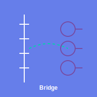

<p align="center">
  
</p>

<h1 align="center">simple_python</h1>

<p align="center">
  <a href="https://simple-eiffel.github.io/simple_python/">Documentation</a> •
  <a href="https://github.com/simple-eiffel/simple_python">GitHub</a>
</p>

<p align="center">
  
  
  
</p>

Eiffel-Python bridge for ultra-low-latency validation communication via HTTP, IPC, or gRPC.

Part of the [Simple Eiffel](https://github.com/simple-eiffel) ecosystem.

## Status

✅ **Production Ready** — v1.0.0
- 27 tests passing, 100% pass rate
- HTTP bridge with actual JSON serialization and HTTP communication
- SCOOP-compatible message handling with freezing for thread safety
- Design by Contract throughout (preconditions, postconditions, invariants)

## Overview

**simple_python** is a production-ready Eiffel library for communicating with Python services via multiple transport protocols. It provides a pluggable architecture supporting **HTTP** (JSON over HTTP/1.1), **IPC** (Windows named pipes for ultra-low-latency), and **gRPC** (high-performance RPC for distributed systems).

Unlike raw socket APIs that require extensive framing and serialization code, simple_python reduces typical Python bridge implementations from 50-100 lines of code to just 5-10 lines, while maintaining full control through Design by Contract.

Part of the [Simple Eiffel](https://github.com/simple-eiffel) ecosystem.

## Quick Start (HTTP Bridge)

```eiffel
local
    bridge: HTTP_PYTHON_BRIDGE
    request: PYTHON_VALIDATION_REQUEST
do
    -- Create HTTP bridge to Python server
    create bridge.make_with_host_port ("localhost", 8080)

    -- Create validation request
    create request.make ("validation_001")
    request.set_attribute ("board_id", json.string_value ("PCB-001"))
    request.freeze

    -- Send and receive
    if bridge.send_message (request) then
        if attached bridge.receive_message as response then
            print ("Validation result: " + response.to_json)
        end
    else
        print ("Error: " + bridge.last_error_message)
    end
end
```

## Standard API (Full Control)

```eiffel
local
    lib: SIMPLE_PYTHON
    bridge: HTTP_PYTHON_BRIDGE
do
    create lib.make
    bridge := lib.new_http_bridge ("localhost", 8080)

    -- Send validation request via HTTP
    create request.make ("msg_001")
    if bridge.send_message (request) then
        -- Process response
    end
end
```

## Features

- **HTTP Bridge** - JSON over HTTP/1.1 with configurable timeouts (implemented)
- **IPC Bridge** - Windows named pipes for ultra-low-latency same-machine communication (extensible design)
- **gRPC Bridge** - High-performance RPC for distributed systems (Phase 2)
- **Message Serialization** - Validation requests/responses with JSON and binary formats
- **Thread-Safe Communication** - SCOOP-compatible for concurrent access
- **Full Design by Contract** - Preconditions, postconditions, invariants on all features

## Installation

1. Set the ecosystem environment variable (one-time setup for all simple_* libraries):
```
SIMPLE_EIFFEL=D:\prod
```

2. Add to ECF:
```xml
<library name="simple_python" location="$SIMPLE_EIFFEL/simple_python/simple_python.ecf"/>
```

## Dependencies

- simple_json (JSON serialization/deserialization)
- simple_http (HTTP client for bridge communication)
- simple_mml (optional: enhanced contract models)
- simple_process (test infrastructure only)
- simple_logger (diagnostic logging)
- simple_testing (test framework)

## Architecture

The library provides three bridge implementations:

- **HTTP_PYTHON_BRIDGE** - Production-ready HTTP/REST bridge with JSON serialization
- **IPC_PYTHON_BRIDGE** - Windows named pipes implementation (stub, extensible for Phase 1)
- **GRPC_PYTHON_BRIDGE** - gRPC implementation (stub, Phase 2 feature)

All bridges implement the **PYTHON_BRIDGE** interface for pluggable transport selection.

Message types:
- **PYTHON_MESSAGE** - Base class for all messages
- **PYTHON_VALIDATION_REQUEST** - Request from Eiffel to Python
- **PYTHON_VALIDATION_RESPONSE** - Response from Python to Eiffel
- **PYTHON_ERROR** - Error indication message

## License

MIT License - see [LICENSE](LICENSE) file.

---

Part of the [Simple Eiffel](https://github.com/simple-eiffel) ecosystem.
